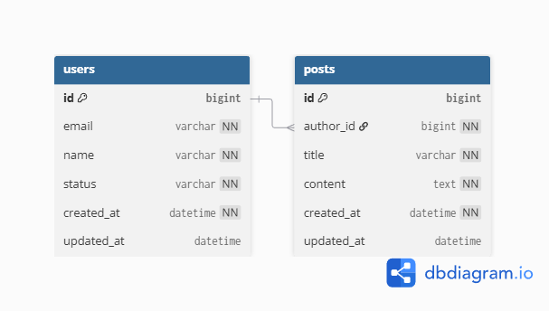

## 🗂 ERD (Entity Relationship Diagram)

본 ERD는 **JPA Entity(User, Post)** 를 기준으로  
실제 데이터베이스 테이블 구조를 도출하여 작성되었습니다.

### 📌 테이블 구성

- `users`
- `posts`

### 📌 관계 설명

- **users (1) : posts (N)**
  - 한 명의 사용자는 여러 개의 게시글을 작성할 수 있습니다.
  - 하나의 게시글은 반드시 한 명의 사용자(작성자)를 참조합니다.

### 📌 설계 기준

- `posts.author_id`는 `users.id`를 참조하는 **외래 키(FK)** 입니다.
- 게시글은 반드시 작성자가 존재해야 하므로 `author_id`는 **NOT NULL** 입니다.
- 주요 컬럼(`email`, `name`, `title`, `content`, `status`)에는  
  **NOT NULL 제약조건**을 적용하여 데이터 무결성을 보장합니다.
- 사용자 상태(`status`)는 Enum(`ACTIVE`, `RESIGNED`) 기반으로 관리됩니다.

### 📌 ERD 다이어그램

> 본 ERD는 서비스 분석 및 환경 설정 단계의 산출물이며,  
> 이후 기능 확장 시 테이블 및 관계가 추가될 수 있습니다.
