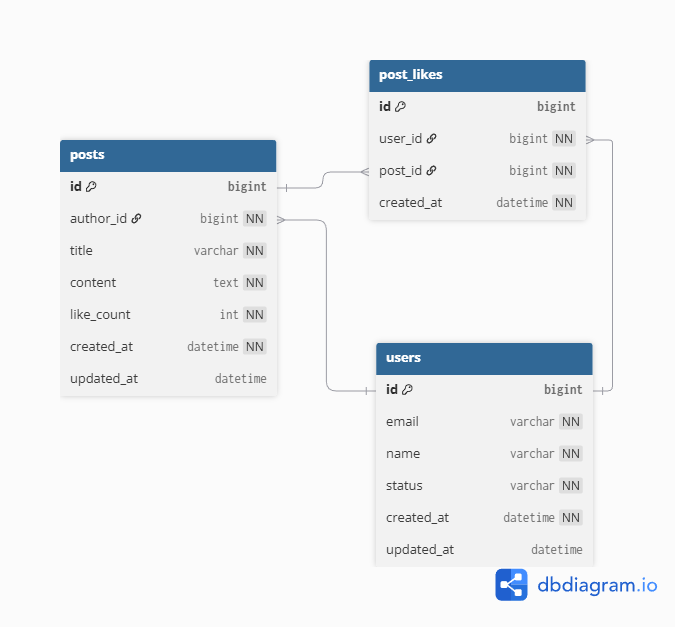

## 🗂 ERD (Entity Relationship Diagram)

본 ERD는 **기존 User, Post 도메인 구조를 분석** 하고,
**게시글 좋아요 기능 확장(PostLike)** 을 고려하여
데이터베이스 테이블 구조를 설계한 문서입니다.

본 문서는 구현 이전 단계의 설계 산출물로,
실제 JPA Entity 및 비즈니스 로직은 추후 단계에서 작성될 수 있습니다.

### 📌 테이블 구성

- `users`
- `posts`
- `post_likes`

### 📌 관계 설명

- **users (1) : posts (N)**
  - 한 명의 사용자는 여러 개의 게시글을 작성할 수 있습니다.
  - 하나의 게시글은 반드시 한 명의 사용자(작성자)를 참조합니다.
- **users (1) : post_likes (N)**
  - 한 명의 사용자는 여러 게시글에 좋아요를 누를 수 있습니다. 
- **posts (1) : post_likes (N)**
  - 하나의 게시글은 여러 사용자로부터 좋아요를 받을 수 있습니다.

### 📌 설계 기준

- `posts.author_id`는 `users.id`를 참조하는 **외래 키(FK)** 입니다.
- 게시글은 반드시 작성자가 존재해야 하므로 `author_id`는 **NOT NULL** 입니다.
- `post_likes` 테이블은 사용자와 게시글 간의 **좋아요 관계(N:M)** 를 표현하기 위한 중간 테이블입니다. 
- 동일 사용자가 동일 게시글에 중복 좋아요를 할 수 없도록
`(user_id, post_id)` 조합에 **UNIQUE 제약조건** 을 적용했습니다. 
- 게시글의 좋아요 수는 `post_likes` 테이블을 기준으로 관리되며, 목록 조회 및 정렬 성능을 고려하여 `posts.like_count` 컬럼에 **집계 값** 으로 저장합니다. 
- `posts.like_count`는 파생 컬럼으로, 좋아요 추가/취소 시 서비스 로직에서 함께 증감됩니다.
- 주요 컬럼(`email`, `name`, `title`, `content`, `status`)에는 **NOT NULL 제약조건**을 적용하여 데이터 무결성을 보장합니다.
- 사용자 상태(`status`)는 Enum(`ACTIVE`, `RESIGNED`) 기반으로 관리됩니다.

### 📌 ERD 다이어그램

> 본 ERD는 서비스 분석 및 좋아요 기능 확장 설계를 반영한 산출물이며, 
> 이후 기능 도입 시 테이블 및 관계가 추가될 수 있습니다.
